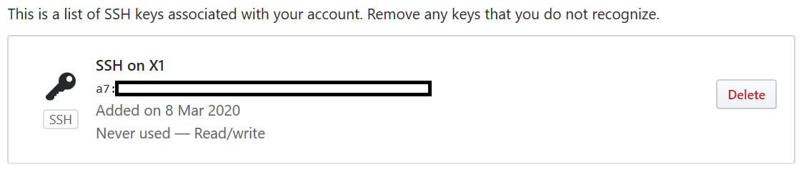

## 安装程序

- VSCode
- Git

## 配置 Git

### For Github

- 打开Git Bash，切换目录到目标文件夹（可能不用）

```shell
dove@LONMP-X1 MINGW64 /e
$ cd GitFile/

dove@LONMP-X1 MINGW64 /e/GitFile
$ ls
Github/  GitServer/
```

- 为Github生成id_rsa

```shell
dove@LONMP-X1 MINGW64 /e/GitFile
$ ssh-keygen -t rsa -C dovecho@gmail.com
Generating public/private rsa key pair.
Enter file in which to save the key (/c/Users/dove/.ssh/id_rsa): id_rsa_github
Enter passphrase (empty for no passphrase):
Enter same passphrase again:
Your identification has been saved in id_rsa_github
Your public key has been saved in id_rsa_github.pub
The key fingerprint is:
SHA256:xxxx dovecho@gmail.com
The key's randomart image is:
+---[RSA 3072]----+
----
+----[SHA256]-----+
```

- 登录Github.com，并在Settings里面配置SSH Key，把刚刚生成的.pub文件里面的全文粘贴进去，会得到这样的结果



- 回到存储.ssh的文件夹，新建一个名为```config```的文件，文本文件

```shell
# 配置github.com
Host github.com
    HostName github.com
    IdentityFile C:\\Users\\dove\\.ssh\\id_rsa_github
    PreferredAuthentications publickey
    User YOURUSERNAME_AT_GITHUB_DOT_COM
```

- 回到Git Bash，测试

```shell
dove@LONMP-X1 MINGW64 /e/GitFile
$ ssh -T git@github.com
The authenticity of host 'github.com (13.229.188.59)' can't be established.
RSA key fingerprint is SHA256:xxxx.
Are you sure you want to continue connecting (yes/no/[fingerprint])? yes
Warning: Permanently added 'github.com,13.229.188.59' (RSA) to the list of known hosts.
git@github.com: Permission denied (publickey).

dove@LONMP-X1 MINGW64 /e/GitFile
$ ssh -T git@github.com
Warning: Permanently added the RSA host key for IP address '13.250.177.223' to the list of known hosts.
Hi dovecho! You've successfully authenticated, but GitHub does not provide shell access.

dove@LONMP-X1 MINGW64 /e/GitFile
$ ssh -T git@github.com
Hi dovecho! You've successfully authenticated, but GitHub does not provide shell access.
```

### For Git Server

Git Server配置在Synology的NAS上面。

目前尚未完成

## 下载测试

在VSCode里面，通过```Ctrl+~```调出控制台，切换目录至Github的存储目录（可以把所有的代码放在一个文件夹里，也可以放在不同文件夹里），然后在命令行中运行：

```bash
git clone git@github.com:dovecho/dovecho.github.io.git
```

## 参考文献

- [Windows下Git多账号配置，同一电脑多个ssh-key的管理](https://www.cnblogs.com/popfisher/p/5731232.html)
- [Gitlab的SSH配置（linux和windows双版本）](https://www.cnblogs.com/fanbi/p/7772812.html)
